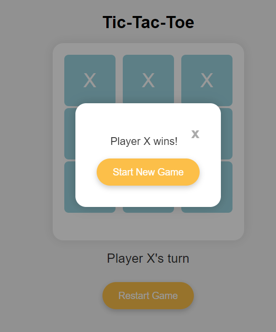

# **Tic-Tac-Toe**
This is a simple web-based Tic Tac Toe game built using HTML, CSS, and JavaScript. The game allows two players to take turns placing "X" and "O" marks on a 3x3 grid. It displays the current player's turn, announces the winner or a draw, and provides a restart button to start a new game.

  

## Features
- Allows two players to take turns placing "X" and "O" marks on a 3x3 grid.
- Displays the current player's turn and announces the winner or a draw.
- Provides a restart button to start a new game.
- Uses a modal to display the game outcome.

## How to Play
1. Open the index.html file in your web browser.
2. Players take turns clicking on empty cells to place their mark.
3. The game announces the winner or a draw when the game ends.
4. Click the "Restart Game" button to start a new game.

## File Structure
- **index.html:** Contains the HTML structure of the game.
- **style.css:** Defines the styling for the game interface.
- **script.js:** Implements the game logic and functionality.
- **README.md:** This file, providing an overview of the project.
- **screenshot.png:** A screenshot of the game.
